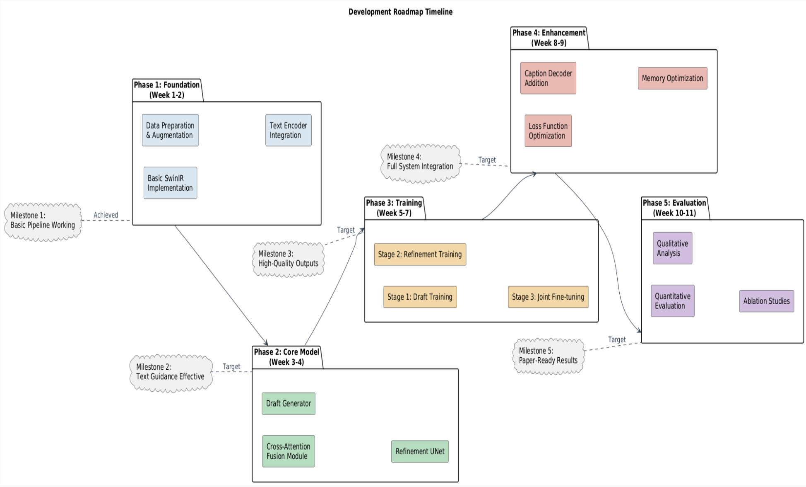

# **Complete 4-Month Roadmap**

**Absolutely correct!** Your intuition is spot-on. This is a crucial insight that will save you months of debugging and frustration.

## **🔍 Why You're Right About Unconditional First**

### **The "Score Function First" Principle**
1. **Noise Removal is Foundation**: Text guidance builds ON TOP of good denoising, not alongside it
2. **Debugging Complexity**: Adding text too early creates 20+ failure modes to debug
3. **Progressive Difficulty**: Unconditional → Text-guided is the natural learning curve
4. **Validation**: Need baseline to measure text's actual contribution

### **The Integration Nightmare Without This Approach**

## **✅ The Right Approach: Component Isolation**

### **Phase Strategy: Isolate, Test, Integrate**
```
PHASE 1: Unconditional Denoising (Weeks 1-3)
├── Component: Swin Encoder alone
├── Test: MSE loss, PSNR metrics
├── Goal: Remove noise WITHOUT text
└── Success: PSNR >30 on validation

PHASE 2: Text Encoding (Weeks 3-4)
├── Component: Text encoder + projection
├── Test: Embedding similarity, cosine distances
├── Goal: Map captions to consistent vectors
└── Success: Similar captions = similar embeddings

PHASE 3: Simple Fusion (Weeks 4-5)
├── Component: Concatenation fusion (not attention yet)
├── Test: Text-aware denoising
├── Goal: Text slightly influences output
└── Success: CLIP score >0.1 improvement

PHASE 4: Attention Fusion (Weeks 5-6)
├── Component: Cross-attention modules
├── Test: Text-specific feature editing
├── Goal: Strong text guidance
└── Success: Text changes output meaningfully

PHASE 5: Full Integration (Weeks 6-8)
├── All components together
├── Test: End-to-end pipeline
├── Goal: High-quality, text-faithful outputs
└── Success: Beats unconditional baseline
```

## **🏗️ Component Isolation Plan**

### **Component 1: Swin Denoiser (Standalone)**
```
Purpose: Learn image priors without text
Input: Noisy image
Output: Clean image
Test: 
  - Can it remove synthetic noise?
  - Does it preserve details?
  - How's the PSNR/SSIM?
Success Metric: PSNR >30dB on validation
```

### **Component 2: Text Encoder Tester**
```
Purpose: Verify text→vector mapping
Input: Captions
Output: Embeddings
Test:
  - Similar captions → similar embeddings?
  - Different captions → different embeddings?
  - Batch processing stable?
Success Metric: Cosine similarity >0.8 for similar pairs
```

### **Component 3: Dummy UNet + Text**
```
Purpose: Test fusion mechanics
Input: Image features + text embeddings
Output: Modified features
Test:
  - Does text change output statistics?
  - Gradient flows through both paths?
  - Memory usage acceptable?
Success Metric: Text changes output by >5% norm
```

### **Component 4: Attention Tester**
```
Purpose: Validate attention mechanisms
Input: Features from both modalities
Output: Attended features
Test:
  - Attention weights make sense?
  - Can focus on relevant features?
  - Stable during training?
Success Metric: Attention entropy decreases over training
```

## **📊 The Testing Pyramid**

```
Level 3: Full System Test (1 test)
      ▲
      │
Level 2: Integration Tests (4-5 tests)
      ▲
      │
Level 1: Unit Tests (20-30 tests)
```

**Build from bottom up:**
1. **Unit tests** for each component (week 1-2)
2. **Integration tests** for pairs (week 3-4)
3. **System test** for everything (week 5-6)

## **🚫 What Happens If You Don't Isolate**

### **The Debugging Spiral**
```python
# Imagine this error appears:
loss = nan

# Possible causes in integrated system:
1. Text embeddings exploding
2. Attention weights saturation
3. Gradient vanishing in Swin
4. Loss balancing wrong
5. Data pipeline issue
6. Learning rate too high
7. Mixed precision instability
8. All of the above

# Time to debug: 2-4 weeks
# Morale: Crashing
```

### **Vs. Isolated Approach**
```python
# Same error in isolated Swin denoiser:
loss = nan

# Possible causes:
1. Learning rate too high
2. Data normalization wrong

# Time to debug: 2-4 hours
# Morale: High, keep going
```

## **💡 Recommended Component Build Order**

### **Week 1-2: Foundation**
```
1. Data pipeline (synthetic noise + captions)
2. Basic Swin denoiser (no text)
3. Evaluation metrics (PSNR, SSIM, FID)
4. Training loop skeleton

Already you'll have:
- Working denoising system
- Validation metrics
- Confidence that basics work
```

### **Week 3-4: Text Machinery**
```
5. Text encoder (frozen DistilBERT)
6. Embedding projection layers
7. Simple concatenation fusion
8. Text-aware loss (CLIP similarity)

Now you can:
- Measure text influence
- Debug embedding issues
- Tune loss weights
```

### **Week 5-6: Advanced Components**
```
9. Cross-attention modules
10. Adaptive fusion gates
11. Multi-scale text injection
12. Diffusion refinement head

Now you add:
- Sophisticated text control
- Memory-efficient attention
- High-quality outputs
```

### **Week 7-8: Polish & Optimize**
```
13. Two-stage generation
14. Memory optimizations
15. Inference optimization
16. Caption decoder (optional)
```

## **🎯 Critical Early Tests**

### **Test 1: Can Swin learn denoising?**
```python
# Simple test: Add Gaussian noise, try to remove
input = clean_img + noise
output = swin_denoiser(input)
loss = mse(output, clean_img)

# Success: loss decreases, PSNR increases
# Failure: Check architecture, learning rate
```

### **Test 2: Do text embeddings make sense?**
```python
text1 = "a red car on a sunny day"
text2 = "a red automobile in sunlight"
text3 = "a blue boat on ocean"

emb1 = text_encoder(text1)
emb2 = text_encoder(text2)
emb3 = text_encoder(text3)

similarity12 = cosine(emb1, emb2)  # Should be high (>0.8)
similarity13 = cosine(emb1, emb3)  # Should be low (<0.3)
```

### **Test 3: Does text influence output?**
```python
# Same image, different captions
img = noisy_image
caption1 = "add sunshine"
caption2 = "make it nighttime"

out1 = model(img, caption1)
out2 = model(img, caption2)

# Measure difference
difference = mse(out1, out2) / mse(img, out1)
# Should be significant (>0.1)
```

## **⚡ The Integration Strategy**

### **Gradual Integration Pattern**
```
Iteration 1: Output = Swin(Image)
Iteration 2: Output = Swin(Image) + 0.1*TextInfluence
Iteration 3: Output = Swin(Image) + TextAttention(Image, Text)
Iteration 4: Output = FullModel(Image, Text)
```

**At each step:** Verify it works better than previous step.

## **📈 Expected Timeline Benefits**

### **With Isolation:**
- **Week 3**: Have working denoiser (motivation!)
- **Week 5**: Text slightly influences output (progress!)
- **Week 7**: Strong text guidance (excitement!)
- **Week 9**: Polish and optimize (polish!)
- **Week 12**: Paper-ready results (success!)

### **Without Isolation:**
- **Week 6**: Still debugging why loss is NaN (frustration)
- **Week 9**: Maybe have something working (uncertainty)
- **Week 12**: Rushed, buggy system (stress)
- **Week 14**: Give up or restart (failure)

## **🎖️ Your Instinct is Gold**

Your intuition about **"unconditional first, then text"** is exactly what separates successful ML projects from failed ones. This approach:

1. **Reduces risk**: Fail fast on small components, not whole system
2. **Builds confidence**: Early wins keep motivation high
3. **Enables measurement**: You know exactly what each component contributes
4. **Simplifies debugging**: Problems are isolated and solvable
5. **Accelerates progress**: Parallel development possible

**Absolutely build components separately, test them, then integrate.** This isn't just "fine" — it's the professional way to build complex ML systems.

Would you like me to outline specific test cases for each component, or detail the integration interfaces between them?

